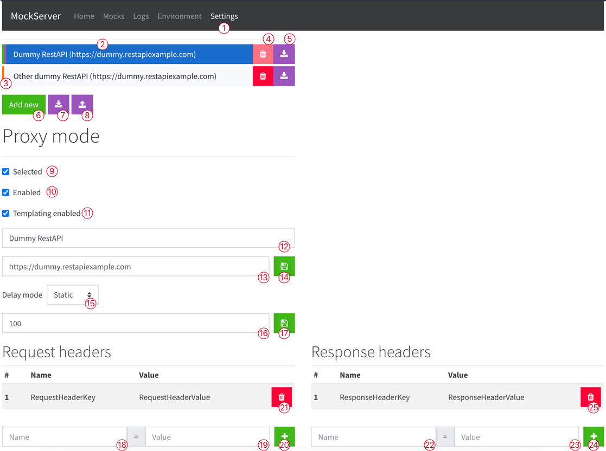
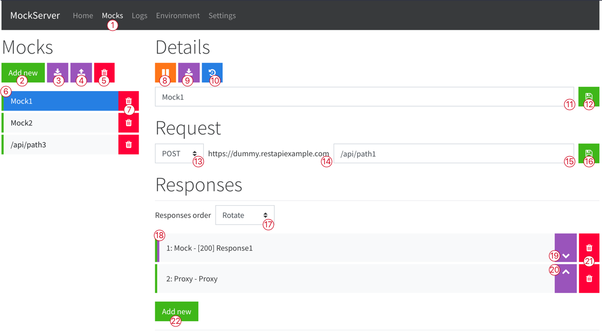
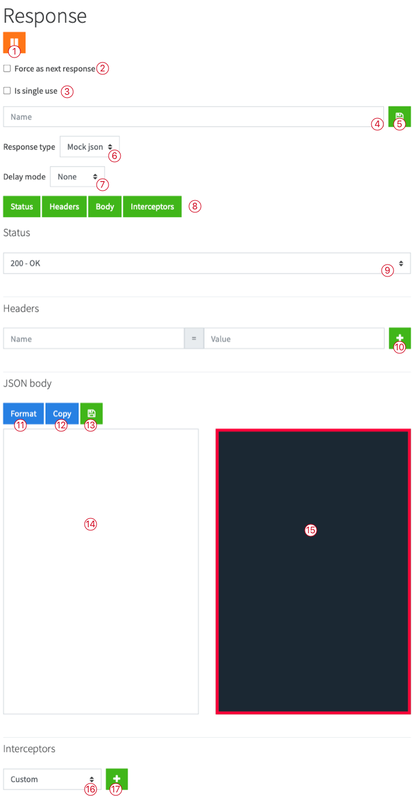
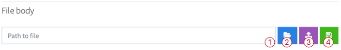
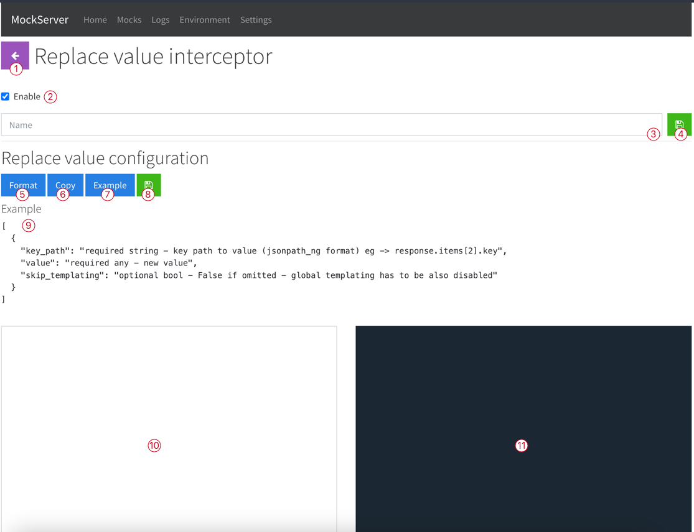
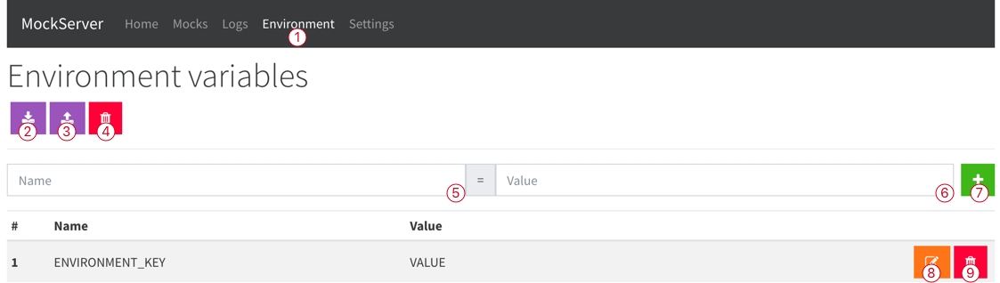

# Admin panel

By default, admin panel is available at: http://127.0.0.1:5012 or http://127.0.0.1:5012/admin.
You can modify `host` and `port`, check [Launching the MockServer section](../docs.md).

## Web panel

### Settings

1. Navigation bar and current selected page
2. Currently edited configuration
3. Configuration status
    - green - enabled
    - orange - disabled
    - violet - selected (active) - only one configuration may be selected at the time
4. Remove configuration - selected configuration can't be removed
5. Export configuration
6. Create new configuration
7. Export all configurations
8. Import configuration
9. Select configuration
10. Enable / disable configuration
11. Templating enabled / disabled, see [Templating section](../docs.md).
12. Configuration name
13. Configuration proxy path
14. Save configuration name and proxy path
15. Delay mode - delay which will be applied for each mock
    - none - no delay
    - static - constant delay value
    - random - random delay from range
16. Delay settings - values in [ms]
17. Save delay settings
18. Header name which will be attached to each proxy request
19. Header value which will be attached to each proxy request
20. Add request header
21. Remove request header
22. Header name which will be attached to each response
23. Header value which will be attached to each response
24. Add response header
25. Remove response header

# Mocks

1. Navigation bar and current selected page
2. Add new mock
3. Export all mocks
4. Import mock
5. Remove all mocks
6. Mock status
    - green - enabled
    - orange - disabled
7. Remove mock
8. Disable / Enable mock
9. Export mock
10. Mock logs
11. Mock name
12. Save mock name
13. Mock request matching HTTP method
14. Mock request matching proxy (currently selected proxy configuration see [Settings](#settings))
15. Mock request path
16. Save mock request path
17. Responses order
    - rotate - rotation order [1, 2, 3, 1, 2, 3, 1, 2] (for three mocks)
    - sequential - sequential order [1, 2, 3, 3, 3, 3] (for three mocks)
18. Mock response status
    - green - enabled
    - orange - disabled
    - violet - response witch will be used for next request,
      see [Mocking mechanism section](../docs.md)
19. Change mock response order - move down
20. Change mock response order - move up
21. Remove mock response
22. Add new mock response
23. Some elements are not visible on screen
    - request rules

## Mock

1. Disable / enable mock
2. Force response to be next response for request, see [Mocking mechanism section](../docs.md)
3. Disable response after use
4. Response name
5. Save response name
6. Response type
    - mock json - returns json value
    - mock file - returns file stream from path
    - proxy - proxy request
7. Delay mode - response delay or settings delay if not set, see [Settings section](#settings)
8. Response tabs
9. Response status code
10. Header attached to the response, see [Settings section](#settings)
11. Format json in input
12. Copy json from input to clipboard - removes pretty formatting
13. Save json body
14. Json body input
15. Json body preview
16. Interceptor type, see [Response interceptors section](../docs.md) and [Mock Interceptor section](#mock-interceptor)
17. Add new interceptor with type

### The configuration for mock file response

1. Path to file - absolute or relative to `MOCK_SERVER_RESOURCES` or `/app/static/` path see [Env section](../docs.md)
2. Show directory - may not work on every machine
3. Upload file
4. Save path

## Mock Interceptor

1. Back to response definition
2. Enable / disable interceptor
3. Interceptor name
4. Save interceptor name
5. Format configuration
6. Format configuration to clipboard - removes pretty formatting
7. Show / hide example
8. Save configuration
9. Configuration example
10. Configuration input
11. Configuration preview

# Logs

**TBD**

# Environment

Environment variables may be used for templating mock and proxy responses. They are stored between requests and may be
modified by API calls. See [Templating section](../docs.md), [Interceptors section](../docs.md),
[API section](./api.md).

1. Navigation bar and current selected page
2. Export all environment variables
3. Import environment variables
4. Remove all environment variables
5. New / edited environment variable name
6. New / edited environment variable value
7. Add / save environment variable
8. Edit environment variable
9. Remove environment variable